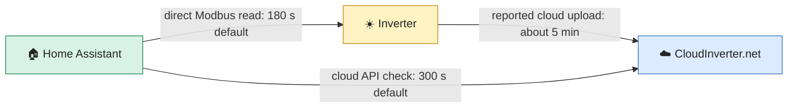

# ☀️ Solar Touch for Home Assistant

<p align="center"></p>

<p align="center">
  <a href="https://github.com/usamakkhan/home-assistant-Solar-Touch/releases"></a>
  <a href="https://github.com/usamakkhan/home-assistant-Solar-Touch/blob/main/LICENSE"></a>
  <a href="https://github.com/usamakkhan/home-assistant-Solar-Touch/actions"></a>
</p>

Read SolarMax/Senergy inverter telemetry in Home Assistant through **one of two setup choices**:

- 🏠 **Get Data Locally using Inverter IP:** Home Assistant reads the inverter's Modbus/TCP bridge directly. No portal login is needed.
- ☁️ **CloudInverter.net:** Home Assistant reads the vendor's HTTPS API using your portal account.

The integration creates sensor entities for available measurements. It does not provide inverter setting controls. Supported readings vary with device, firmware, and selected source.

The integration's internal folder and domain remain `cloud_inverter` for upgrade
compatibility. Existing entity IDs and dashboard references are preserved; an
existing entity ID may still start with `sensor.cloud_inverter_` after the
display name changes to Solar Touch.

> [!NOTE]
> **License from v1.5.0:** [PolyForm Strict License 1.0.0](https://github.com/usamakkhan/home-assistant-Solar-Touch/blob/main/LICENSE). It permits noncommercial use but does not grant permission to redistribute the integration, sell copies, or publish modified versions. Copyright © 2026 Usama Khan. Earlier versions released under MIT retain their original license terms.

> [!IMPORTANT]
> GitHub currently reports PolyForm Strict as an unidentified license (`NOASSERTION`), so this repository's **HACS validation action fails its license check**. The code tests pass. If HACS does not offer this version, use the [manual installation steps](https://github.com/usamakkhan/home-assistant-Solar-Touch/blob/main/INSTALL.md#manual). The project will not label this release as MIT to make validation pass because that would grant rights the maintainer has not offered.

> [!IMPORTANT]
> On the installation reported by the project owner, the **inverter uploads data to CloudInverter.net about every five minutes**. A Home Assistant cloud refresh can happen more often, but it may receive the **same uploaded reading** until the inverter sends its next update. The integration does not control the inverter's upload schedule.

## 🧭 Choose your data source

| | 🏠 Direct inverter LAN | ☁️ CloudInverter.net |
| --- | --- | --- |
| Setup label | **Get Data Locally using Inverter IP** | **CloudInverter.net** |
| Home Assistant connects to | Inverter LAN IP and Modbus/TCP port | Vendor HTTPS API |
| Default interval | **180 seconds** between collection attempts | **300 seconds (5 minutes)** between API requests |
| Adjustable interval | **10–900 seconds** in Options | **30–900 seconds** in Options |
| Default port / unit | **502 / 1**, both editable | Not applicable |
| Portal credentials | Not required | Required |
| Internet for readings | Not required | Required |
| Hardware profile | SolarMax/Senergy PV9000/ONYX register profile | Supported portal response fields |



The diagram shows the two available paths; select one when adding the integration. The reported five-minute upload is **device-to-cloud traffic**, while the 300-second and 180-second values are **Home Assistant read intervals**. Matching the cloud interval to the reported upload cadence avoids most repeated API requests, but the two clocks are not synchronized. A direct LAN capture can be delayed by a quiet window around the estimated cloud upload period, so its actual spacing may exceed 180 seconds.

## 📊 What data appears in Home Assistant?

Depending on the source and inverter, readings can cover:

- **Solar production:** PV power, input voltage/current, and MPPT values.
- **Grid:** signed Grid Power plus separate **Instantaneous Power Import** and
  **Instantaneous Power Export** sensors, voltage, current, and energy counters
  when provided. Positive Grid Power is import; negative Grid Power is export.
- **Battery:** state of charge, charge/discharge power, voltage/current, and energy when reported.
- **Loads and outputs:** available household, backup, and generator-side measurements.
- **Device health:** operating mode, temperatures, status, and selected device metadata.

Cloud and direct LAN paths have different field sets. A missing register or portal field is not treated as zero. Home Assistant assigns entity IDs when it creates entities, so check your device page for the actual names. The app does **not** invent readings before a successful capture.

### ⚡ Add CloudInverter.net sensors to the Energy dashboard

Open **Settings → Dashboards → Energy** and use the following cumulative **kWh** sensors for the matching fields. Use the actual entity IDs shown on your Solar Touch device page.

| Energy dashboard field | Solar Touch sensor |
| --- | --- |
| Solar panels → solar production | **Total Energy** |
| Electricity grid → energy imported from grid | **Grid Import Total** |
| Electricity grid → energy exported to grid | **Grid Export Total** |
| Home battery → energy going into the battery | **Battery Charge Total** |
| Home battery → energy coming out of the battery | **Battery Discharge Total** |

**Total Energy is the inverter's lifetime production counter.** Home Assistant uses changes in a cumulative sensor, not a sum of every displayed reading. If a counter starts at 0 and later reads 1, 4, and 5 kWh, the day's gain is **5 kWh**, not 10 kWh. If Home Assistant first observes it at 1 kWh, that first reading is its baseline and it records the later **4 kWh** gain. A lifetime counter works the same way: an example initial 10,000 kWh is a starting point, not 10,000 kWh of new production. Do not add both **Daily Energy** and **Total Energy** as solar production sources for the same inverter; that would count one production stream twice. Power readings in W or kW describe the current rate, while these energy readings are in kWh.

If one of these sensors is missing from a selector, open **Settings → Developer Tools → States** and find its actual entity ID. Check that it has a numeric state, `device_class: energy`, `state_class: total_increasing`, and `unit_of_measurement: kWh`. These are set by the integration for the cloud total sensors. Then check **Settings → Developer Tools → Statistics** for errors affecting that entity, and confirm the Recorder integration is recording it. Home Assistant's [Energy FAQ](https://www.home-assistant.io/docs/energy/faq/) explains the selector requirements, and its [long-term statistics guide](https://www.home-assistant.io/docs/configuration/long-term-statistics/) explains how cumulative changes are counted. If it still does not appear, report the exact Energy field, entity ID, and sanitized attributes; hide serial numbers and account details.

Home Assistant controls the Energy dashboard's suggested choices and saved configuration. The integration exposes eligible sensors, but you select each sensor in the matching Energy field.

**Instantaneous Solar Production**, **Instantaneous Power Import**, and
**Instantaneous Power Export** are power sensors in W for live dashboards. The
Energy dashboard's production and consumption totals require the cumulative
kWh sensors in the table above. An unavailable signed Grid Power reading leaves
both derived power sensors unavailable; it is not interpreted as zero.

## 🚀 Install in Home Assistant

### Option A: HACS

1. In HACS, add `https://github.com/usamakkhan/home-assistant-Solar-Touch` as a **custom Integration repository**.
2. Install **Solar Touch** from HACS.
3. Restart Home Assistant.
4. Go to **Settings → Devices & services → Add integration**, search for **Solar Touch**, and choose your data source.

### Option B: manual installation

1. Download the [latest release](https://github.com/usamakkhan/home-assistant-Solar-Touch/releases) or the repository ZIP.
2. Copy the entire `custom_components/cloud_inverter` directory into Home Assistant's `/config/custom_components/` directory. The result should contain `/config/custom_components/cloud_inverter/manifest.json`.
3. Restart Home Assistant, then add **Solar Touch** from **Settings → Devices & services**.

See the [detailed installation guide](https://github.com/usamakkhan/home-assistant-Solar-Touch/blob/main/INSTALL.md) for step-by-step setup, network checks, and updating. HACS and manual installation provide the same two setup choices.

## 🏠 Set up direct inverter LAN access

1. Confirm that **Home Assistant itself** can reach the inverter's LAN IP. Use `192.168.50.10` as an example; replace it privately with your inverter's address.
2. Add **Solar Touch → Get Data Locally using Inverter IP**.
3. Enter the **Inverter LAN IP**. Leave the separate **Modbus/TCP port** at `502` and **unit ID** at `1` unless your bridge requires other values.
4. Leave the **collection interval** at `180` seconds to start. You can change it later in **Options**.
5. Submit the form. Home Assistant probes read-only Modbus register `0x1001` and shows the IP, port, unit ID, and returned raw value on a **confirmation page**. Check these before the final submit.
6. Confirm to create the entry and allow the first full capture. Check the new device's sensors after it completes.

The initial probe confirms that a Modbus response came from the entered endpoint; it does not guarantee that every register on every model/firmware is supported. Direct collection runs **inside Home Assistant** on the configured Modbus/TCP port.

> [!CAUTION]
> A 10-second interval is permitted, but frequent Modbus reads **interrupted cloud delivery and turned the datalogger light red on the reported installation**. Start at 180 seconds, observe the datalogger and portal over multiple five-minute upload cycles, and adjust only if your hardware tolerates it. The collector uses estimated quiet windows near the five-minute boundary; these cannot guarantee uninterrupted cloud uploads because the actual upload phase can vary.

## ☁️ Set up CloudInverter.net

1. Add **Solar Touch → CloudInverter.net**.
2. Enter your portal username and password. Choose an inverter if the account has more than one.
3. Wait for the first API update, then inspect the device and sensor states.
4. If desired, change the API refresh interval in **Options** (30–900 seconds).

The default is **300 seconds (5 minutes)** because the inverter uploads about that often on the reported installation. Even at this interval, consecutive requests can return the same snapshot if the upload and polling clocks do not line up or a cloud update is delayed. You can select 30–900 seconds in Options. Changing the Home Assistant refresh interval does **not** change how often the inverter transmits to the vendor. Existing entries with a custom interval saved in Options keep that choice.

Credentials are stored in the Home Assistant config entry; the API session token is kept in memory. Protect Home Assistant backups. If website login works but integration login fails, check the portal/API status and share only sanitized logs in an issue.

Accounts with multiple inverters can add a separate CloudInverter.net entry for each inverter. Each entry has its own sensor identities; upgrading existing entries preserves their current entity IDs and dashboard references.

## 🔄 Upgrading from an older analyzer setup

Version 1.4.0 removes the separate analyzer application and its cached HTTP source. If you previously configured **Local analyzer** in Solar Touch, remove that entry from **Settings → Devices & services**, then add **Get Data Locally using Inverter IP**. Enter the **inverter's own LAN IP**, Modbus/TCP port (default `502`), and unit ID (default `1`). An analyzer computer's address or HTTP port cannot be reused as the inverter endpoint. Existing direct LAN and cloud entries continue to use their saved settings.

Removing an old entry may remove its Home Assistant entities. Review dashboards and automations that refer to their entity IDs after adding the direct source.

## 🔧 Troubleshooting

| Symptom | Check |
| --- | --- |
| **Solar Touch** is missing after installation | Verify `/config/custom_components/cloud_inverter/manifest.json` exists, remove any extra directory nesting, and restart Home Assistant. |
| Portal website accepts login but the integration rejects it | Verify the same account, current portal availability, and the sanitized Home Assistant API error. Website and API responses can differ. Never post credentials or tokens. |
| Direct IP check fails | Verify the inverter IP, Modbus/TCP port (default `502`), unit ID (default `1`), LAN routing, and bridge availability from the Home Assistant host. |
| IP check succeeds but sensors are unavailable | The probe checks one register. Verify the PV9000-compatible profile, wait for the full capture and quiet window, then inspect sanitized Modbus errors in Home Assistant logs. |
| Cloud readings repeat | Check the reading timestamp and allow for the reported **about-five-minute** inverter upload cadence. More frequent API requests can return the same snapshot. |
| Cloud uploads stop or datalogger turns red | Increase the direct collection interval or stop local collection while you check the hardware. The reported installation had this behavior with 10-second polling. |
| An older Local analyzer entry fails after updating | Remove that entry and add the direct LAN source using the inverter's own IP and Modbus/TCP port. Review entity IDs used by dashboards and automations. |

Temporary debug logging:

```yaml
logger:
  logs:
    custom_components.cloud_inverter: debug
```

Remove or redact passwords, tokens, account IDs, serials, MAC addresses, and private LAN addresses before sharing logs or screenshots. Documentation examples use `ABCDE123456789` as a sample serial. Historical Git commits may contain older example values; review them before reposting material.

## 🧪 Development, support, and license

- Run the integration tests with `python -m unittest discover -s tests -v`. They cover signing, URL validation, direct Modbus checks, capture behavior, and freshness logic; they do not replace a real inverter and Home Assistant test.
- Review release changes in the [changelog](https://github.com/usamakkhan/home-assistant-Solar-Touch/blob/main/CHANGELOG.md) and report reproducible problems through [GitHub Issues](https://github.com/usamakkhan/home-assistant-Solar-Touch/issues), using sanitized details.
- Versions from v1.5.0 use the [PolyForm Strict License 1.0.0](https://github.com/usamakkhan/home-assistant-Solar-Touch/blob/main/LICENSE). For redistribution or commercial licensing, contact the copyright holder. Bundled integration icons live in [`brand/`](https://github.com/usamakkhan/home-assistant-Solar-Touch/tree/main/custom_components/cloud_inverter/brand); [Home Assistant's brand image guidance](https://developers.home-assistant.io/docs/core/integration/brand_images/) explains how Home Assistant displays integration assets.
